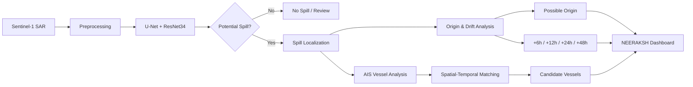
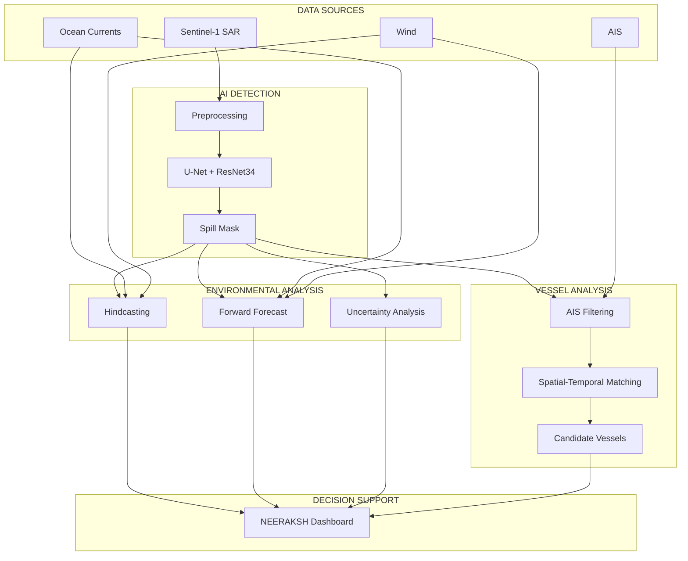

🌊 NEERAKSH
AI-Powered Maritime Oil Spill Intelligence
Detect • Predict • Trace • Protect
 
 
 
 
 
Smart India Hackathon 2026 · Problem Statement 26143 · Team EdgeCase

📌 Overview
NEERAKSH is an AI-powered maritime intelligence platform designed to connect three important stages of oil-spill analysis:
Detect → Predict → Trace

The platform starts with Sentinel-1 SAR imagery to identify potential oil-spill regions using deep learning. The detected spill can then be analyzed with environmental information to estimate a possible origin and study its potential movement. Historical AIS vessel data can subsequently be examined to identify vessels whose movements may be relevant to the suspected source.
The goal is to bring these different sources of information into one workflow and provide a practical decision-support system for maritime and environmental response teams.
Important: NEERAKSH is a decision-support platform. A candidate vessel identified through spatial and temporal analysis is an investigative lead, not proof of responsibility.

🎯 Problem
An oil spill is not simply an image-classification problem.
When a spill is detected, several questions immediately follow:
- Where is the potential spill?
- Is the detected dark region actually oil or a SAR lookalike?
- Where could the spill have originated?
- How might it move over the next 48 hours?
- Which vessels were operating near the possible source?
- How can satellite, environmental and vessel information be analyzed together?
Traditional workflows may require analysts to work across multiple datasets and tools. NEERAKSH is designed to connect these steps into a single pipeline.
Key Challenges
Challenge	Why it matters
SAR lookalikes	Natural ocean-surface phenomena can resemble oil spills
Unknown source	Oil may move away from its release location before detection
Dynamic movement	Wind and currents continuously affect the slick
Large AIS search space	Many vessels may operate around the incident region
Fragmented information	Satellite, environmental and vessel data may be analyzed separately
Uncertainty	Source and trajectory estimates are not exact observations

💡 Proposed Solution
NEERAKSH combines three complementary capabilities.
🛰️ 1. Detect — AI-Based Oil Spill Detection
Sentinel-1 SAR imagery is processed using a U-Net segmentation model with a ResNet34 encoder.
The model uses:
- VV SAR polarization
- VH SAR polarization
- Oil scenes
- No-Oil scenes
- Lookalike scenes
The output is a pixel-level segmentation mask highlighting regions that may contain oil.
🌊 2. Predict — Origin & Spill Movement
The detected spill location and observation time can be combined with environmental information such as:
- Ocean currents
- Wind
- Satellite observation timestamp
The proposed environmental module is designed to:
- Estimate a possible source region
- Analyze backward movement toward a probable origin
- Forecast possible movement after detection
- Visualize potential positions at +6h, +12h, +24h and +48h
- Represent uncertainty where appropriate
🚢 3. Trace — AIS-Based Vessel Analysis
Historical AIS data can be examined around the estimated source region and incident time window.
The proposed workflow considers:
- Vessel position
- Timestamp
- Movement history
- Spatial proximity
- Temporal alignment
The objective is to generate candidate vessels for further investigation, rather than automatically assign responsibility.
🔄 End-to-End Workflow

🧠 AI Detection Model
Architecture
U-Net + ResNet34
Component	Configuration
Architecture	U-Net
Encoder	ResNet34
Input	2-channel SAR
Channels	VV + VH
Output	Pixel-level segmentation mask
Training	Oil + No-Oil + Lookalike
Loss	BCE + Dice
Inference threshold	0.5

Preprocessing
During model development:
1. VV/VH backscatter values are clipped to [-30, 0] dB
2. Values are normalized to [0, 1]
3. Images are processed as 256 × 256 patches
📊 Dataset
NEERAKSH uses three complementary datasets.
Part I — Oil Images & Masks
- 1,200 oil images provided
- 1 corrupt image (00893.tif) excluded
- 1,199 usable oil scenes
Zenodo — Oil Dataset
Part II — No-Oil & Lookalike
- 685 No-Oil scenes
- 685 Lookalike scenes
Zenodo — No-Oil & Lookalike Dataset
Development Dataset Summary
Category	Scenes
Oil	1,199
No-Oil	685
Lookalike	685
Total	2,569

These scenes were converted into:
37,030 × 256 × 256 image patches
Independent Test Dataset
A separate dataset contains:
- 150 Oil scenes
- 150 No-Oil scenes
- 150 Lookalike scenes
- 450 scenes total
Zenodo — Independent Test Dataset
The independent dataset is kept separate from model development. Final independent-test metrics should only be reported after the current joint model has been evaluated on it.
📈 Model Validation
The best recorded joint-validation checkpoint achieved:
Metric	Result
IoU	69.42%
Dice	81.95%
Precision	81.70%
Recall	82.20%
False Positive Rate	1.40%

These are validation results for the oil-spill detection model. They are not end-to-end NEERAKSH performance metrics and should not be interpreted as independent-test results.

🌊 Environmental Drift Analysis
A satellite image shows where a spill is observed, but that location may not be where the spill originally entered the water.
NEERAKSH therefore includes a proposed environmental analysis layer.
Backward Analysis — Hindcasting
Starting from the observed spill region, backward particle movement can be used to investigate possible source regions.
Potential environmental inputs include:
- CMEMS ocean currents
- ERA5 wind information
- Satellite observation time
- Particle-based transport modelling
Forward Analysis — Forecasting
After source estimation, forward modelling can be used to study possible spill movement.
Planned forecast horizons:
Horizon	Purpose
+6h	Near-term movement
+12h	Short-term movement
+24h	One-day projection
+48h	Extended response planning

The accuracy of these forecasts depends on environmental data quality, modelling assumptions and validation against real observations.
🚢 AIS-Based Vessel Attribution
NEERAKSH does not simply select the nearest vessel.
Instead, the proposed workflow connects:
Observed Spill
      ↓
Possible Source Region
      ↓
Incident Time Window
      ↓
Historical AIS Trajectories
      ↓
Spatial + Temporal Matching
      ↓
Candidate Vessels
Relevant AIS attributes may include:
- Vessel position
- Timestamp
- Heading
- Speed
- Vessel identity
- Historical movement
The resulting candidates are intended to help investigators focus their attention on relevant vessel records.
A vessel being near a suspected source does not establish that it caused the spill. AIS records may also contain gaps or incomplete observations.

🗺️ NEERAKSH Dashboard
The dashboard is designed to bring the different outputs together in one GIS-oriented interface.
Planned / Prototype Views
- 🛰️ Satellite observation
- 🛢️ Detected spill region
- 📍 Estimated source region
- 🌊 Potential spill trajectory
- ⏱️ Observation and incident timeline
- 🚢 Historical vessel tracks
- 🔎 Candidate vessel information
- 📊 Uncertainty and confidence visualization
The purpose is to reduce the need to manually switch between satellite, environmental and vessel-analysis tools.
🏗️ System Architecture

🛠️ Tech Stack
Technology	Role
Python	Core development
PyTorch	Deep learning
Segmentation Models PyTorch	U-Net implementation
U-Net	Semantic segmentation
ResNet34	Encoder
Sentinel-1	SAR satellite imagery
Raster / Geospatial Tools	Image and spatial processing
CMEMS	Ocean-current information
ERA5	Wind reanalysis
GFS	Forecast wind information where integrated
AIS	Vessel movement data
OpenDrift / OpenOil	Proposed drift and oil-weathering modelling
GIS / Web Mapping	Visualization
Hugging Face	Model hosting

✅ Current Status
Completed
- [x] Sentinel-1 VV/VH preprocessing
- [x] Oil / No-Oil / Lookalike dataset preparation
- [x] U-Net + ResNet34 training
- [x] Joint model validation
- [x] 256 × 256 patch-based inference
- [x] Public model checkpoint hosting
- [x] Prototype dashboard/interface work
In Development / Proposed Integration
- [ ] Full environmental hindcasting
- [ ] Validated 48-hour drift forecasting
- [ ] Uncertainty-aware source estimation
- [ ] Historical AIS integration
- [ ] Candidate-vessel ranking
- [ ] Bayesian attribution research integration
- [ ] End-to-end platform validation
- [ ] Live inference/API deployment
This separation is intentional: the trained detection model is an established project component, while the broader environmental and vessel-attribution workflow requires additional implementation and validation.
🚀 Why NEERAKSH?
01 — Lookalike-Aware Detection
Instead of treating every dark SAR region as oil, the model is trained using Oil, No-Oil and Lookalike scenes.
02 — Detection to Investigation
NEERAKSH is designed to connect:
Satellite Detection → Origin Estimation → Drift Analysis → AIS Investigation
03 — Dual-Polarization SAR
The model uses both VV and VH information.
04 — Spatial + Temporal Vessel Analysis
The proposed attribution workflow considers both where a vessel was and when it was there.
05 — Uncertainty-Aware Approach
The broader architecture is designed to represent uncertainty in source and trajectory estimation instead of presenting predictions as exact facts.
06 — Human-in-the-Loop
NEERAKSH is designed to assist experts, not replace formal investigation or field verification.
🌍 Impact & Applications
Indian Coast Guard / Maritime Authorities
Support incident assessment by bringing spill detection, environmental information and vessel activity into one view.
Environmental Agencies
Help identify potential spill regions and areas that may require further monitoring.
Port Authorities
Support investigation of maritime activity around suspected pollution incidents.
Spill Response Teams
Provide a structured view of possible spill movement to support response planning.
Research & Monitoring
Provide a foundation for further work in:
- SAR oil-spill detection
- Ocean drift modelling
- Uncertainty estimation
- AIS analytics
- Maritime environmental intelligence
⚠️ Limitations & Responsible Use
NEERAKSH should be treated as a decision-support system.
Satellite Detection
SAR lookalikes can resemble oil spills. AI predictions require appropriate review and validation.
Geographic Analysis
Real-world coordinates and physical spill area require suitable georeferenced satellite data.
Drift Forecasting
Spill trajectories are estimates and depend on environmental inputs, modelling assumptions and validation.
AIS Data
AIS records may contain gaps or missing observations.
Vessel Attribution
A candidate vessel is an investigative lead. Spatial proximity alone does not establish responsibility.
🤗 Getting Started
Download the Trained Model
The trained detection checkpoint is publicly hosted on Hugging Face:
NEERAKSH Oil Detection Model →
Install Dependencies
pip install torch segmentation-models-pytorch huggingface-hub
Load the Model
import torch
import segmentation_models_pytorch as smp
from huggingface_hub import hf_hub_download

device = "cuda" if torch.cuda.is_available() else "cpu"

path = hf_hub_download(
    repo_id="goyalharshit18/Neeraksh-oil-detection",
    filename="best_joint_unet_resnet34.pth"
)

model = smp.Unet(
    encoder_name="resnet34",
    encoder_weights=None,
    in_channels=2,
    classes=1,
    activation=None
).to(device)

checkpoint = torch.load(
    path,
    map_location=device,
    weights_only=True
)

model.load_state_dict(
    checkpoint.get("model_state_dict", checkpoint)
)

model.eval()
Input Format
The model expects two-channel Sentinel-1 SAR input:
Channel 0 → VV
Channel 1 → VH
The preprocessing configuration used during model development was:
Clip:       [-30, 0] dB
Normalize:  [0, 1]
Patch:      256 × 256
Threshold:  0.5
🔗 Project Links
Resource	Link
💻 GitHub	Spill Tracker
🤗 Trained Model	NEERAKSH Oil Detection
🛢️ Oil Dataset	Zenodo
🌊 No-Oil + Lookalike	Zenodo
🧪 Independent Test Set	Zenodo
🛰️ Copernicus Data Space	Copernicus

🗺️ Roadmap
Phase 1 — AI Detection
- [x] Sentinel-1 SAR preprocessing
- [x] VV/VH two-channel input
- [x] U-Net + ResNet34
- [x] Oil / No-Oil / Lookalike training
- [x] Validation
- [x] Public model hosting
Phase 2 — Geospatial Intelligence
- [ ] Georeferenced inference pipeline
- [ ] Automated spill-area calculation
- [ ] Geographic spill localization
- [ ] Observation-time integration
Phase 3 — Drift Intelligence
- [ ] Backward source estimation
- [ ] Forward 48-hour trajectory modelling
- [ ] Environmental forecast integration
- [ ] Uncertainty regions
- [ ] Real-world trajectory validation
Phase 4 — Vessel Attribution
- [ ] Historical AIS integration
- [ ] Spatial-temporal filtering
- [ ] Candidate vessel scoring
- [ ] Bayesian attribution research integration
Phase 5 — Operational Platform
- [ ] Live inference service
- [ ] Automated satellite ingestion
- [ ] Updated environmental feeds
- [ ] Incident alerts
- [ ] Automated reporting
- [ ] Scalable deployment
📚 Research & References
NEERAKSH is informed by research in three major areas:
SAR Oil-Spill Detection
Research highlights the difficulty of distinguishing oil slicks from natural SAR lookalikes.
NEERAKSH: Joint training with Oil, No-Oil and Lookalike scenes.
Bayesian Spill-Source Estimation
Research highlights uncertainty when reconstructing an unknown spill source.
NEERAKSH: Uses this research direction as a foundation for future uncertainty-aware source localization.
SAR-AIS Vessel Tracing
Research shows that a vessel's location at satellite observation time may differ from its location at the time of discharge.
NEERAKSH: Connects estimated source location and time with historical AIS trajectories rather than simply selecting the nearest vessel.
👥 Team
Team EdgeCase
Smart India Hackathon 2026
Problem Statement: 26143
Problem: Leveraging satellite imagery to determine oil spills at sea along with AIS data correlations to identify vessel responsible for the spill.
Add the final registered team-member names and roles here before publishing the repository.
🙏 Acknowledgments
NEERAKSH builds upon open satellite, geospatial, oceanographic and machine-learning ecosystems.
We acknowledge:
- Copernicus Sentinel-1 — SAR satellite observations
- Copernicus Marine Service (CMEMS) — oceanographic data
- ECMWF / ERA5 — atmospheric reanalysis
- NOAA / GFS — forecast weather data where applicable
- Zenodo — oil-spill datasets
- PyTorch — deep-learning framework
- Segmentation Models PyTorch — segmentation implementation
- OpenDrift / OpenOil — proposed particle-based drift and oil-weathering modelling
- Hugging Face — model hosting

🌊 NEERAKSH
Detect. Predict. Trace. Protect.
Built for Smart India Hackathon 2026

